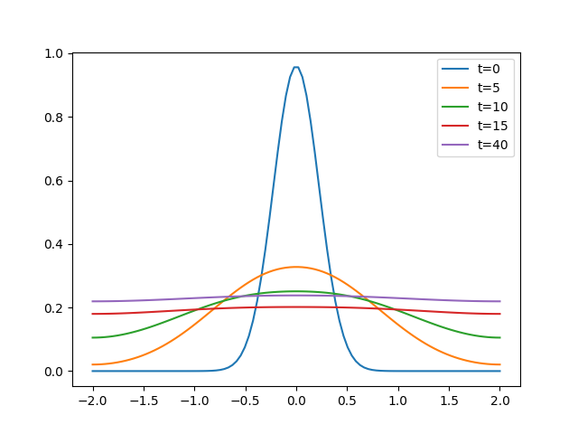

.. currentmodule:: bacoli_py

########################
Documentation & Tutorial
########################

.. contents:: Table of Contents
    :depth: 2

*************
Documentation
*************

The class of PDEs which can be solved using :mod:`bacoli_py` are 1D time-dependent PDEs of the form:

.. math::
    u_{t}(x,t) = f(t, x, u(x,t), u_{x}(x,t), u_{xx}(x,t)), \quad a \leq x \leq b, \quad t_{0} \leq t \leq t_{f}

With separated homogeneous boundary conditions:

.. math::
    b_{L}(t, u(a,t), u_{x}(a,t)) = 0, \quad b_{R}(t, u(b,t), u_{x}(b,t)) = 0, \quad t_0 \leq t \leq t_f

And initial conditions:

.. math::
    u(x,t_0) = u_{0}(x), \quad a \leq x \leq b

These problems are solved using an adaptive error control algorithm, with computes an approximate solution which has an associated error estimate which is a beneath a user-specified error tolerance.

To use :mod:`bacoli_py`, you must first initialize the solver by creating a :class:`bacoli_py.BacoliPy` solver object. This solver object can then be suppled a :class:`bacoli_py.ProblemDefinition` object, which defines the PDE system you wish to solve. Following these initialization steps, a call to the :class:`~BacoliPy.solve` method can be made, computing a approximate solution returned within a :class:`bacoli_py.Solution` object.

To define a new :class:`bacoli_py.BacoliPy` object, you may optionally supply its constructor with arguments controlling how the underlying PDE solver will work:

|

-------------------------------------

========
BacoliPy
========

.. py:function:: bacoli_py.BacoliPy(nint_max=500, kcol=4, t_est='b', x_est='loi', maxord=None, ini_ss=None)

Optional Arguments:
-------------------

* *nint_max* - The maximum number of subintervals partitioning the spatial domain. Increasing nint_max may be necessary when solving difficult problems with low error tolerance. Default value is 500.

* *kcol* - The number of collocation points per spatial subinterval. Default value is 4.

* *t_est* - Specifies what kind of method will be used in time integration. 'b' for a variable order BDF method, 'r' for a 5th order Runge-Kutta method.

* *x_est* - Specifies the spatial error estimation scheme used by BACOLI. 'loi' for a lower order interpolation scheme (LOI) and 'sci' for a superconvergant interpolation scheme (SCI). Default value is 'loi'.

* *maxord* - Specifies the maximum order of the BDF method used for time integration. Default is 5.

* *ini_ss* - Specifies the initial step size used for time integration. If not provided will be chosen by underlying time integration software.

-------------------------------------

|

You can then define the PDE system you wish to solve by creating a :class:`bacoli_py.ProblemDefinition` object. This requires the creation of callback functions which define the system itself, its initial conditions, and its boundary conditions. Optionally, you may define the partial derivatives of the PDE system as a Jacobian matrix, as well as the partial derivatives each boundary conditions; defining these matrices may improve the performance of the solver.

|

-------------------------------------

=================
ProblemDefinition
=================

.. py:function:: bacoli_py.ProblemDefinition(npde, f, bndxa, bndxb, uinit, derivf=None, difbxa=None, difbxb=None)

Object containing problem-specific information on the PDE to be solved.

Required Arguments:
-------------------

* *npde* - The number of PDE's in this system.

* *f(t, x, u, ux, uxx, fval)* - A callback function defining a system of PDE's, each of the form :math:`u_{t} = f(t, x, u, ux, uxx)`. Returns array fval of size npde

* *bndxa(t, u, ux, bval)* - A callback function defining boundary conditions of the form :math:`b(t,u,ux) = 0` at the left spatial endpoint. Returns array bval of size npde

* *bndxb(t, u, ux, bval)* - A callback function defining boundary conditions of the form :math:`b(t,u,ux) = 0` at the right spatial endpoint. Returns array bval of size npde

* *uinit(x, u)* - A callback function defining initial conditions of the form :math:`u(t0, x) = u_0`. Returns array u of size npde

Optional Arguments:
-------------------

* *derivf(t, x, u, ux, uxx, dfdu, dfdux, dfduxx)* - A callback function specifying the partial derivatives of f with respect to u, ux, and uxx in analytic Jacobian matrices. Returns the (npde) x (npde) matrices dfdu, dfdux, and dfduxx

* *difbxa(t, u, ux, dbdu, dbdux, dbdt)* - A callback function specifiying the differentiated boundary conditions at the left spatial endpoint with respect to u, ux, and t. Returns the (npde) x (npde) matrices dbdu and dbdux, as well as the array dbdt as size npde

* *difbxb(t, u, ux, dbdu, dfdux, dbdt)* - A callback function specifiying the differentiated boundary conditions at the right spatial endpoint with respect to u, ux, and t. Returns the (npde) x (npde) matrices dbdu and dbdux, as well as the array dbdt as size npde

----------------------------------------

|

Once the ProblemDefinition object has been created, :mod:`bacoli_py` can now be used to solve this system. This is done using the :class:`BacoliPy.solve` method:

|

----------------------------------------

=====
solve
=====

.. py:function:: BacoliPy.solve(problem_definition, initial_time, initial_mesh, tspan, xspan, atol=1e-6, rtol=1e-6, dirichlet=False, tstop=None, deriv=False)

Computes an error controlled numerical numerical solution for a given system of PDE's at specified points in space and time.

Required Arguments:
-------------------
* *problem_definition* - A ProblemDefinition object defining the PDE system to be solved.

* *initial_time* - The beginning of the temporal domain.

* *initial_mesh* - An initial mesh partitioning the spatial domain. Must include the beginning and end of the spatial domain as first and final elements respectively. If initial_mesh only contains the start and end points of the spatial domain, a uniform initial mesh of 10 subintervals will be generated. Must be a numpy.ndarray.

* *output_points* - numpy.ndarray containing the points at which the solution will be output.

* *output_times* - numpy.ndarray containing times at which the solution will be output.

Optional Arguments:
-------------------

* *atol* - The absolute error tolerance. May be a scalar value or a numpy.ndarry of size npde. Default value is :math:`10^{-4}`.

* *rtol* - The relative error tolerance. May be a scalar value or a numpy.ndarray of size npde. Default value is :math:`10^{-4}`.

* *dirichlet* - Specifies if both boundary conditions are Dirichlet.

* *tstop* - Scalar value specifying the absolute end of the temporal domain.

* *deriv* - Boolean value indicating whether solution derivative values are to be returned at the requested output points in the Solution object.

----------------------------------------

|

:class:`BacoliPy.solve` produces a :class:`bacoli_py.Solution` object containing the solutions of each PDE in the system at each output points and output time. These values may be accessed directly from the :class:`Solution.u` property.

|

----------------------------------------

=========
Solution
=========

.. py:function:: bacoli_py.Solution(self, tspan, xspan, u, ux=None)

Object containing solution from call to :class:`bacoli_py.solve`.

Public Instance Variables:
--------------------------

* *xspan* - Times across the temporal domain the solution for which a solution has been output at each requested spatial output point.

* *tspan* - Points across the spatial domain for which a solution has been requested for various output times.

* *u* - The numerical solution computed obtained for this problem. A numpy ndarray object with shape=(npde, output_times.size, output_points.size).

* *ux* - The first spatial derivative values for numerical solution computed obtained for this problem. A numpy ndarray object with shape=(npde, output_times.size, output_points.size).

----------------------------------------

|

The quickest way to learn how to use :mod:`bacoli_py` is to take a look at the tutorial example, as well as the other :doc:`examples <examples/examples>`.

****************
Tutorial Example
****************

Consider the following model for the spread of influenza though a population along a general spatial domain.

.. math::

    S_t &= -\beta\frac{E + I}{N}S - \mu S + rN(1-\frac{N}{K}) + d_1S_{xx} \\
    E_t &= \beta\frac{E + I}{N}S - (\mu + \sigma + \kappa)E + d_2E_{xx} \\
    I_t &= \sigma E - (\mu + \alpha + \gamma)I + d_3I_{xx} \\
    R_t &= \kappa E + \gamma I - \mu R + d_4R_{xx}

This system is solved over the spatial domain :math:`-2 \leq x \leq 2`, with homogeneous Neumann boundary conditions:

.. math::

    S_{x}(-2,t) &= E_{x}(-2,t) = I_{x}(-2,t) = R_{x}(-2,t) = 0, \\
    S_{x}(2,t) &= E_{x}(2,t) = I_{x}(2,t) = R_{x}(2,t) = 0

And with the initial conditions:

.. math::
    S(x,0) &= 0.96e^{-10x^{2}}, \\
    E(x,0) &= 0.0, \\
    I(x,0) &= 0.04e^{-100x^{2}}, \\
    R(x,0) &= 0.0

We will now demonstrate how to solve this PDE system at 4 different output times, t = 0, 5, 10, 15, 40.

First we import :mod:`bacoli_py`, numpy, as well as numpy.array and numpy.exp::

    import bacoli_py
    import numpy
    from numpy import array
    from numpy import exp

Now create a :class:`BacoliPy` object. We choose the optional parameter nint_max = 1000 to increase the maximum allowable number of spatial subintervals::

    solver = bacoli_py.BacoliPy()

Initialization of problem-dependent parameters::

    be = 0.514
    gam = 0.20
    mu = 5.5e-5
    r = 0.0714
    ka = 1.0
    sig = 0.50
    kb = 0.1857
    alph = 0.0093
    d1 = 0.05
    d2 = 0.025
    d3 = 0.001
    d4 = 0.01

To define this PDE system, specify the number of PDE's in this system and all the callback functions necessary to create a :class:`ProblemDefinition` object::

    # Specify the number of PDE's in the system.
    npde = 4

    # Function defining the PDE system.
    # N = Total population at time t.
    #
    # S = fval[0] = Number of individuals in host population susceptible to 
    #     influenza
    #
    # E = fval[1] = Number of individuals who have been exposed to influenza and
    #     are currently in the latent period of the disease.
    #
    # I = fval[2] = Number of individuals who are currently infected with influenza.
    #
    # R = fval[3] = Number of individuals who have recovered from the disease.
    def f(t, x, u, ux, uxx, fval):
        N = u[0] + u[1] + u[2] + u[3] 
        fval[0] = -be*u[0]*(u[1] + u[2])/N - mu*u[0] + r*N*(1 - N/ka) + d1*uxx[0]
        fval[1] = be*u[0]*(u[1] + u[2])/N - (mu + sig + kb)*u[1] + d2*uxx[1]
        fval[2] = sig*u[1] - (mu + alph + gam)*u[2] + d3*uxx[2]
        fval[3] = kb*u[1] + gam*u[2] - mu*u[3] + d4*uxx[3]
        return fval

    # Function defining the left spatial boundary condition. Homogeneous Neumann
    # boundary conditions of form f_{i}(t, u_{i}, u_{i}x) = 0 (i = 1... npde) are
    # used at the left spatial boundary.
    def bndxa(t, u, ux, bval):
        bval[0] = ux[0]
        bval[1] = ux[1]
        bval[2] = ux[2]
        bval[3] = ux[3]
        return bval

    # Function defining the right spatial boundary condition. Homogeneous Neumann
    # boundary conditions of form f_{i}(t, u_{i}, u_{i}x) = 0 (i = 1... npde) are
    # used at the right spatial boundary.
    def bndxb(t, u, ux, bval):
        bval[0] = ux[0]
        bval[1] = ux[1]
        bval[2] = ux[2]
        bval[3] = ux[3]
        return bval

    # Function defining the initial conditions.
    # Population of susceptible and infected individuals are most concentrated at
    # the origin of the spatial domain.
    def uinit(x, u):
        u[0] = 0.96*exp(-10*(x**2))
        u[1] = 0.0
        u[2] = 0.04*exp(-100*(x**2))
        u[3] = 0.0
        return u

We now instantiate the :class:`ProblemDefinition` object to encapsulate this initial-boundary value problem::

    problem_definition = bacoli_py.ProblemDefinition(npde, f=f, bndxa=bndxa, 
            bndxb=bndxb, uinit=uinit)

Now we set values for the arguments which will be used to solve this system. Initial time t0 = 0, and uniform initial mesh of 10 spatial subintervals is chosen between the points x = -2 and x = 2. Absolute and relative error tolerances of :math:`10^{-6}` are chosen, meaning that our computed solution will be accurate to within this tolerance. We also choose points in time and space for which we want our solution to be output::

    # Set t0.
    initial_time = 0.0

    # Make initial spatial mesh of 10 uniformly spaced partitions of the spatial 
    # domain, with a left boundary of -2 and right boundary of 2.
    initial_mesh = numpy.linspace(-2, 2, 11)

We now have everything we require for solving this system. We choose output points at each of our initial mesh points and output times of t = 0, 5, 10, 15, 40::

    # Set the times at which the solution should be output.
    tspan = array([0.0, 5.0, 10.0, 15.0, 40.0])

    # Set the points at which the solution should be output.
    xspan = numpy.linspace(-2, 2, 100)

    # Solve this system for each output time and point.
    solution = solver.solve(problem_definition, initial_time, initial_mesh,
                                      tspan, xspan)

To plot the first component of the solution::

    # Use matplotlib.pyplot to plot the distribution of the susceptible population 
    # at each time.
    import matplotlib
    matplotlib.use('agg')
    import matplotlib.pyplot as plt

    # Plot all all times on same graph.
    plt.plot(xspan, solution.u[0,0,:])
    plt.plot(xspan, solution.u[0,1,:])
    plt.plot(xspan, solution.u[0,2,:])
    plt.plot(xspan, solution.u[0,3,:])
    plt.plot(xspan, solution.u[0,4,:])

    plt.legend(['t=0', 't=5', 't=10', 't=15', 't=40'])

    plt.savefig("tutorial_graph.png")

The first solution component plotted:

The code used in this example can be found :doc:`here <examples/examples.example1>`.

Additional examples can be found :doc:`here <examples/examples>`.

Some additional examples can be found on the `BACOLI webpage <http://cs.stmarys.ca/~muir/BACOLI-3_Webpage.htm>`_, they are written in Fortran but it should be simple to translate them into Python.